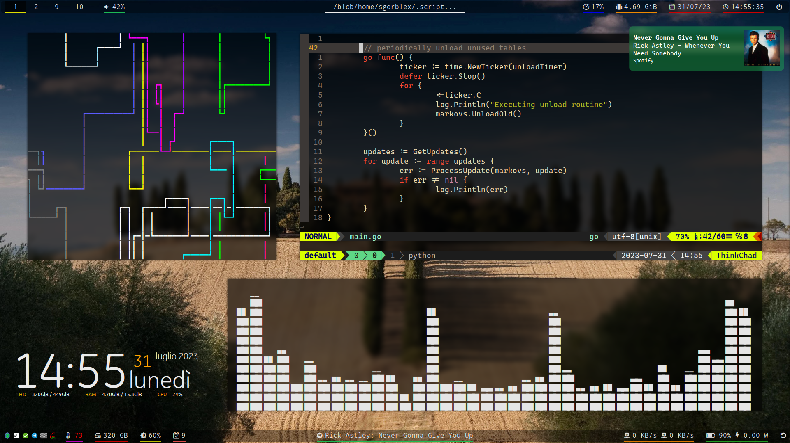

# Sgorblex's dotfiles
These are the dotfiles for my current config/rice.



## TL;DR
```sh
git clone https://github.com/sgorblex/dotfiles
cd dotfiles
stow -t ~ module1 module2 module3
```


## Modules
A module is a set of configuration files. This repository is organized to use `stow`. Stow is a symbolic link manager and its purpose in this context is automatically creating symlinks to a module's configs in the right directories. Each module has its own directory in the repository. Each directory contains a tree of files relative to the user's `HOME`; for example at the moment the directory for the module `neovim` looks something like this:
```
neovim
├── .clang-format
└── .config
    ├── bash
    │   ├── editor.bashrc
    │   └── manpager.bashrc
    ├── fish
    │   └── config.fish.d
    │       ├── nvim-editor.fish
    │       ├── nvim-fzf.fish
    │       └── nvim-manpager.fish
    └── nvim
        ├── coc-settings.json
        ├── init.vim
        ├── plugins.conf.d
        │   ├── airline.conf.vimrc
        │   │   ...
        │   └── vimtex.conf.vimrc
        ├── plugins.conf.vimrc
        ├── plugs.vimrc
        │   ...
        └── spell
            ├── en.utf-8.add
            └── it.utf-8.add
```

Stow will create symbolic links in the directories `~/.config/nvim`, which contains the main configurations, `~/.config/bash`, and `~/.config/fish`, both containing neovim shell integrations, as well as a file named `.clang-format` in the user's HOME. Of course, it will manage eventual conflits: for example, the module `bash` uses `~/.config/bash`, but stow will put in a newly created directory both modules' symlinks. This system allows to divide the configs in packages and, at the same time, to manage integrations between modules.

See [Module list](###Module-list) for a list of available modules.


## How to...


### Install a module
To install one or more modules, clone this repository, `cd` into it, make sure you have `stow` installed and use the command:
```
stow -t $HOME <modules' names>
```

The parameter `-t $HOME` can be omitted if the repository was cloned in `$HOME`. Remember not to delete the cloned repository, since the files will only be linked, not copied.


### Upgrade a module
In the repository's directory, use the command:
```
git pull && stow -t $HOME -R <modules' names>
```

You might not need to use `stow` if there are no new or deleted files.


### Remove a module
In the repository's directory, use the command:
```
stow -t $HOME -D <module's name>
```


## Module info and dependencies
Each module has an information file stored in [modules](.modules/). These files are organized to give a basic idea of what each software provides, including both mandatory and additional dependencies.

The software is referred to as Arch packages from official repositories or AUR, although it's not hard to find the respective packages in any distro or in the various GitHub repositories.


### Module list
- [bash](.modules/bash.md)
- [conky](.modules/conky.md)
- [discord](.modules/discord.md)
- [dunst](.modules/dunst.md)
- [fish](.modules/fish.md)
- [fonts](.modules/fonts.md)
- [i3](.modules/i3.md)
- [mime](.modules/mime.md)
- [mpv](.modules/mpv.md)
- [neovim](.modules/neovim.md)
- [picom](.modules/picom.md)
- [polybar](.modules/polybar.md)
- [powerline shell](.modules/powerline-shell.md)
- [qimgv](.modules/qimgv.md)
- [qtvkbd](.modules/qtvkbd.md)
- [ranger](.modules/ranger.md)
- [rofi](.modules/rofi.md)
- [scripts](.modules/scripts.md)
- [starship](.modules/starship.md)
- [tmux](.modules/tmux.md)
- [x](.modules/x.md)
- [xournalpp](.modules/xournalpp.md)
- [zathura](.modules/zathura.md)
